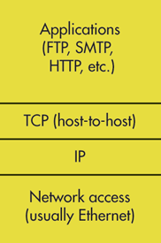

# Beej Guide To Network Programming


## General 
- `AF_INET ` refers to internet ipv4. `address family`. `PF_INET` and `protocol family`refers to anything with prococol or sockes/ports.
- 
## Sockets
- A way to speak to other programs using standard unix file descriptors
- File Descriptors are integer that is associated with open file. Different from PID(Process Identifier)
- Use `open()` or `socket()` and it will return a file descriptor which is a handle that is used to identify the file and the mode of operation.
- Mainly Two types of internet sockets
	- `SOCK_STREAM` : stream sockets
		- Reliable socket stream
		- connection must be made between sender and receiver.
		- Used for HTTP, telnet
		- Uses TCP  
	- `SOCK_DGRAM` : datagram sockets
		- connectionless 
		-  used for `multiplayer games` , 
		- Uses UDP(User Datagram Protocol)
		- `ACK`(acknowledge signal)  for reliable trasnportation

### Difference between TCP/IP and TCP protocol
- TCP/IP is a stack with different layers where TCP is just one of its protocol in network transport layer.
#### TCP

#### TCP/IP stack
- for TCP RFC 793(transport layer) and for IP RFC 791(network layer protocol)


## Network Theory

- OSI model 
	- `Please do not throw my salami pizza away`
	- Physical , data link layer, Network, transport, session , presentaion , application

- For UNIX network programming the simple model is
 
	- Application Layers
	- Host to host transport layer (TCP, UDP)
	- Internet Layer (IP and routing)
	- Netowk Access Layer(Ethernet , wifi etc)

## IP Addresses , Structs And Data Mungling

- IPV4 vs IPv6
- 2^32 vs 2^128 

### Subnets
- seperation of `network portion` and `host portion`.  
- Class A , B , C 
	- Defined by netmask. If your netmask is `255.255.0.0` 
	- Another way is `192.168.0.12/30` where 30 is network portion 
### Port numbers
- Besides IP there is another adress used by TCP and UDP. It is port number. 16 bit number
- hotel : IP address, room number: port
- `/etc/services` has list of all possible port numbers

### Byte order
- Big Endian And Little Endian.
- Big Endian
	- if you want to store `b34f` first store b3 then store 4f . 0x2000 ma b3, 0x2001 ma 4f
	- `Network` byte order 
- Little Endian 
	- intel
	- `Host` Byte order

`htons()` `host` to `network` `short	`
`htonl()` `host` to `network` `long`
`ntohl()` `network`to `host` `short` 

### Structs
- `sin_` means `sockaddr_in`,`ai_` means `addrinfo`,` sa_` means `sockaddr`
- Socket Descriptor is `int`
- `struct addrinfo` : is more recent invention and is used to prep the socket address structures for subsequent use. 
 ```c
 struct addrinfo {
	 int ai_flags; // ai_passive, ai_cannonname
	 int ai_family; // af_inet, af_inet6, af_unspec, af_bluetooth
	 int ai_socktype; //sock_stream, sock_dgram
	 int ai_protocol; //  use 0 for any
	 size_t sockaddr *ai_addr; // struct sockaddr_in and _in6
	 char *ai_canonname; //full canonical hostname
	 
	 struct addrinfo *ai_next; //linked list
 }

struct sockaddr {
	unsigned short sa_family; // address family, AF_INET, AF_inet6 
	char sa_data[14]; // 14 bytes of protocol address
}

// sockaddr and sockaddr_in are castable

struct sockaddr_in {
	short int sin_family; //address family, AF_INET
	unsigned short int sin_port; //port number
	struct in_addr sin_addr;
	unsigned char sin_zero[8];
}

//192.168.0.1
struct in_addr {
	uint32_t s_addr; // 32-bit int(4 bytes)
}

//stores socket address information. can hold both ipv4 and ipv6 
struct sockaddr_storage {
	short ss_family; //address family such as AF_INET.
	
	char __ss_pad1[_SS_PAD1SIZE]; // 48 bit pad that ensures 64 bit alignment for ipv4. 16 remain which is aligned. 
	int64_t __ss_align;
	char __ss_pad2[_SS_PAD2SIZE];  
}


```


###  IP Addresses

```c
struct sockaddr_in sa;
struct sockaddr_in6 sa6;

//convert IPV4 and IPV6 from text to binary form.
//presentation to network
inet_pton(AF_INET, "10.12.110.57", &(sa.sin_addr));


//network to presentation
//ntop
inet_ntop(AF_INET6, &(sa6.sin6_addr), ip6, INET6_ADDRSTRLEN);
printf("%s\n",ip6);
```

### private (or disconnected) networks

- starts with `10.0` or `192.`
- for ipv6 starts with `fdXX` where X is hexadecimal notation.
 
 ## System calls or Bust
 
 - `getaddrinfo()`- prepare to launch.
 ```c
 int getaddrinfo(const char *node // example.com
		,const char *service // http , port number
		,const struct addrinfo *hints 
		,struct addrinfo **res);
 ```
 
## Socket()  - get file descriptor 

```c
#include <sys/types.h>
#include <sys/socket.h>

getaddrinfo("www.example.com", "http", &hints, &res);

//get file descriptor
int socket(int domain, int type, int protocol);
s = socket(res->ai_family, res->ai_socktype, res->ai_protocol);
```

### `bind()`
- the port number is used by the kernel to match an incoming packet to a certain process's  socket descriptor.
```c
int bind(int sockfd, struct sockaddr *my_addr, int addrlen);
```

#### To bind localhost and port number
```c
struct addrinfo hints, *res;
int sockfd; //socket file descriptor

memset(&hints, 0, sizeof hints);
hints.ai_family = AF_UNSPEC; // can use IPv4 or IPv6
hints.ai_socktype = SOCK_STREAM;
hints.ai_flags = AI_PASSIVE; // bind the ip of the host the program is running on. 

getaddrinfo(NULL, "2490", &hints, &res);

//get the socketfd  
sockfd = socket(res->ai_family, res->ai_socktype, res->ai_protocol);
//finally bind port to the IP using bind.
bind(sockfd, res->ai_addr, res->ai_addrlen);
// sockfd is socket file descriptor and ai_addr contains IP info for network layer. can be converted to presentation layer(human readable ip format) with inet_ntop()

```

### `Connect()`

```c
connect(int sockfd, struct sockaddr *serv_addr, int addrlen);
// get sockfd from socket()
// get sockaddr from getaddrinfo() , requires hints.ai_family and ai_socktype
// get addrlen from sizeof
```

### `Listen()`
```c
int listen(int sockfd, int backlog);
//backlog is incoming connection that are going to wait in the queue before accept()


//sequence 
getaddrinfo();
socket();
bind();
listen();
```

### `accept()`
- Once you accept you will have two socket file descriptors to work with. 
	- first one will be used to accept incoming connection
	- second will be used for connection between  our computer and the connection we just accepted. 
```c
#include <sys/types.h>
#include <sys/socket.h>

int accept(int sockfd, struct sockaddr *addr, socklen_t *addrlen);
```

### `send() and recv()`
```c
int send(int sockfd, const void *msg, int len, int flags); //-1 on error
int recv(int sockfd, void *buf, int len, int flags);
```

### datagram way `sendto()` and `recvfrom()`

- needs `to` and `tolen`
- you can `connect()` a UDP too, so send() and recv() will work.
```c
int sendto(int sockfd, const void *msg, int len, unsigned int flags, const struct sockaddr *to, socklen_t tolen);
```

